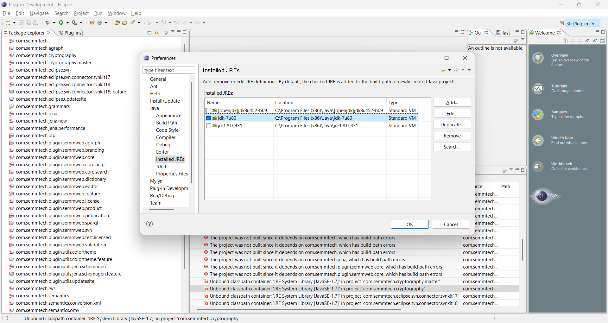
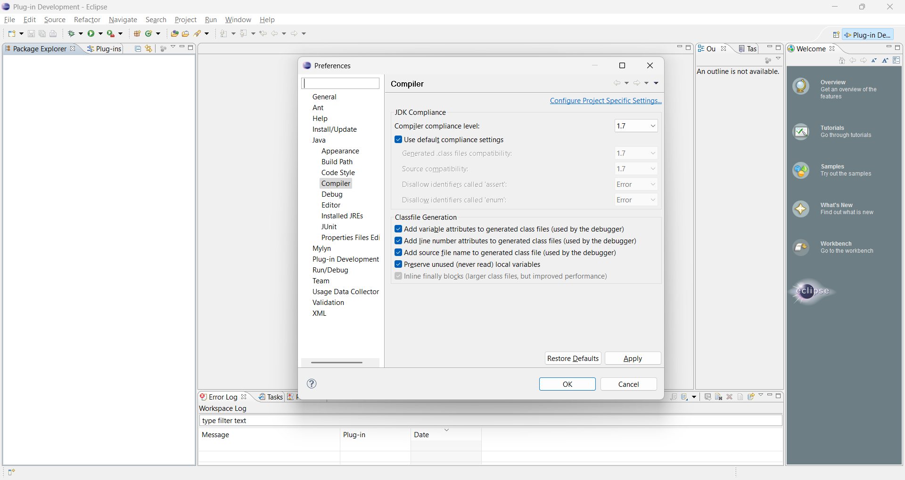
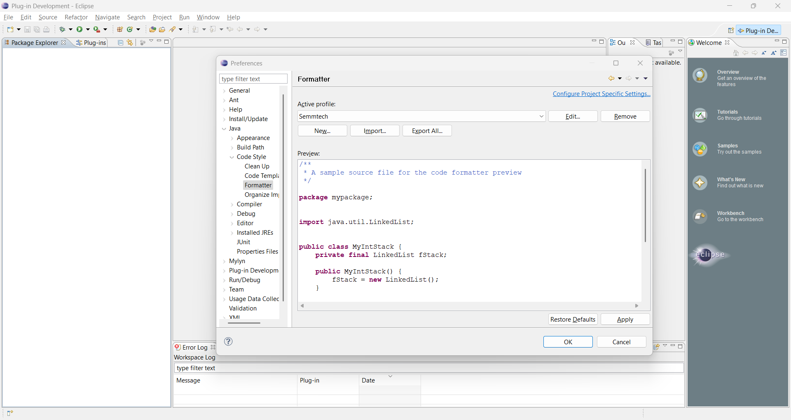
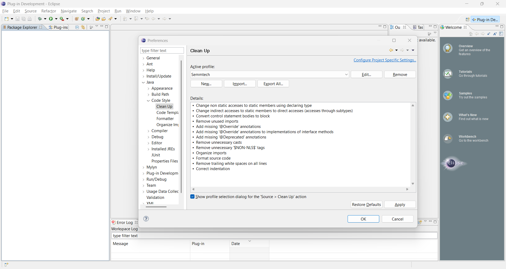
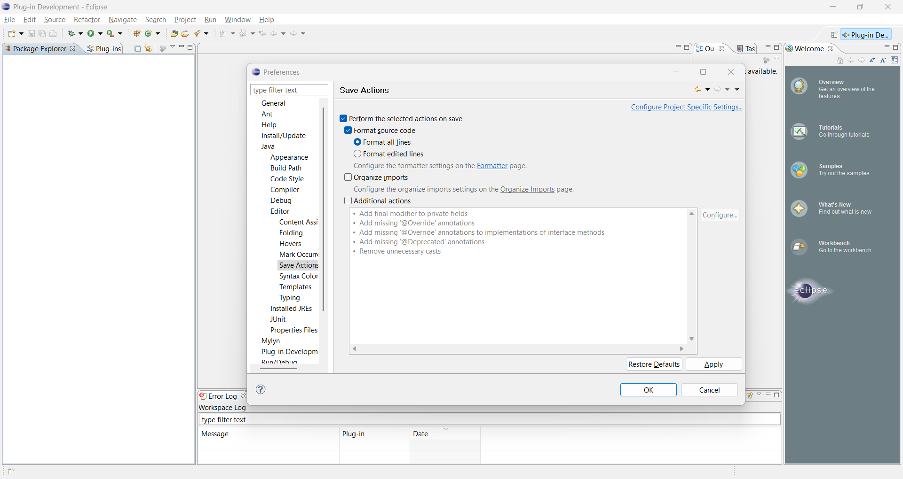
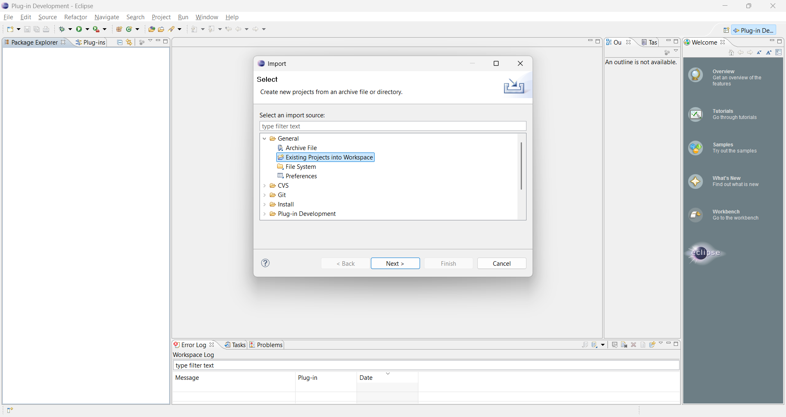
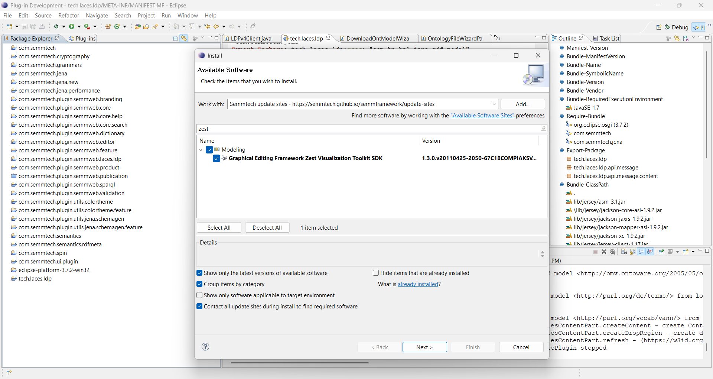
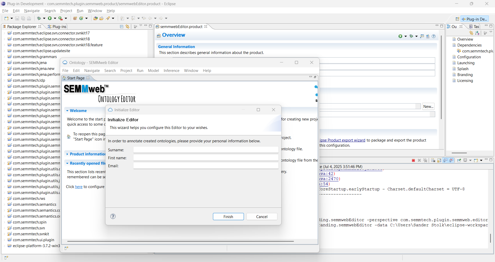

# SEMMweb Model Editor

## Development Environment

This section describes the setup for those wishing to contribute to the development of the editor. If you wish to contribute, please create a fork of this Github project on which to work. Please communicate any relevant changes that you commit to the fork by means of pull requests, ideally referencing a Github issue that the update concerns.

### Installing the environment

- Install Java 7 JDK, 32-bit version, from [here](https://www.oracle.com/java/technologies/javase/javase7-archive-downloads.html) (alterantively you could get it from [here](https://jdk.java.net/java-se-ri/7)).
- Install Eclipse Indigo for RCP and RAP developers, 32bit version, from [here](https://www.eclipse.org/downloads/packages/release/indigo/sr2/eclipse-rcp-and-rap-developers).
- Alternatively, one can install a later version of Eclipse for RCP and RAP developers, and configure that version to set the Target Platform to a directory containing Eclipse Indigo.
- It is recommended to update the 'cacerts' file of Java 7 by copying one from the latest JRE or JDK. This file, by default located in Windows at "C:\Program Files (x86)\Java\jre7\lib\security\cacerts", lists CA certificates. An outdated list can prevent data from HTTPS addresses from being obtained successfully, as a number of current certificate authorities are then unrecognised. If this file is left unupdated, the editor will fail to import some ontologies (e.g., Dublin Core Terms <http://purl.org/dc/terms/>).

### Configuring the environment

Let's start by setting up Eclipse Indigo with the most important settings:

- Add the Java 7 JDK as an installed JREs (Window > Preferences > Java > Installed JREs) and set it as the default one 
- Set the Java compiler compliance level to "1.7" (Window > Preferences > Java > Compiler) 
- Set the Java codestyle formatter to load the settings stored in [Semmtech - JDT - Formatter.xml](./conf/Semmtech%20-%20JDT%20-%20Formatter.xml) (Window > Preferences > Java > Code Style > Formatter) 
- Set the Java codestyle formatter to load the settings stored in [Semmtech - JDT - Clean Up.xml](./conf/Semmtech%20-%20JDT%20-%20Clean%20Up.xml) (Window > Preferences > Java > Code Style > Clean Up) 
- Set the Java save actions to format all lines of source code upon saving (Window > Preferences > Java > Editor > Save Actions) 

Now let's start by adding the SEMMweb Edior sourcecode.

- Import all projects, i.e., the main folders (File > Import > General\Existing Projects into Workspaces) 
- Point the root directory to your clone Git repo folder
- Install two additional plugins (Help > Install New Software) 
  - Use the update site `https://semmtech.github.io/semmframework/update-sites`
  - Install plugin "Graphical Editing Framework Zest Visualisation Toolkit SDK"
  - Install plugin "Eclipse Color Theme"
  - After installation restart Eclipse

In case issues persist in projects, please try cleaning all projects (Project > Clean > Clean all projects) and building them again afterwards. The build process triggers automatically automatically after cleaning, if the "Build automatically" feature is checked under the Project menu.

Now we should be ready to start the SEMMweb Editor from Eclipse:

- Open the file semmwebEditor.product (currently located in the project com.semmtech.plugin.semmweb.product) and select "Launch an Eclipse application" ([screenshot](img/eclipse-launchProduct.png)).
- Running the SEMMweb Editor application will likely fail the first time around.
- Close the SEMMweb Editor application (in case it was opened).
- Open the new run configuration for this product (Run > Run Configurations...), and in the Plug-ins tab click the buttons "Add Required Plug-ins", and select all the Workspace plugins, then click "Apply".
- Run the product using the modified configuration (Run > Run, or for debugging, Run > Debug) 

## Disclaimer

The code within this project is offered as-is, and has not been developed actively since 2016.
